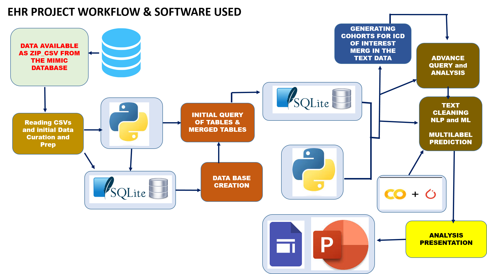
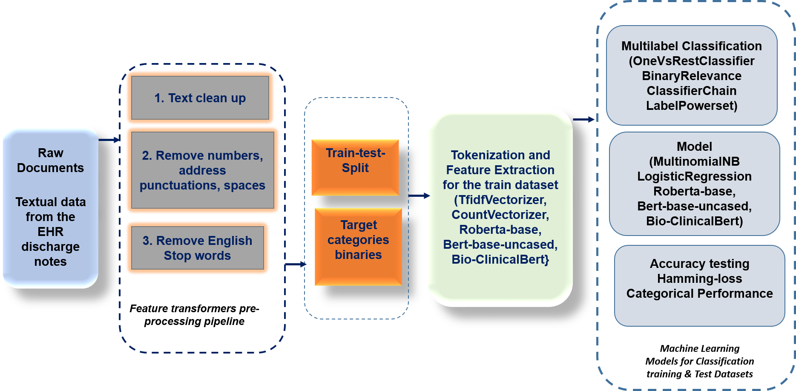
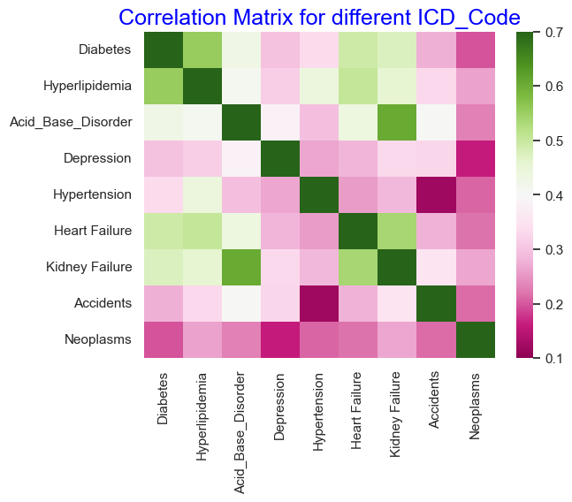

# Electronic Health Records Exploration for Multilabel Classification

## _Introduction:_
The overall well-being of a person is an attribute of their mental and physical health. There is strong evidence that race/ethnicity and social determinants of health significantly impact outcomes for physical and mental health. An electronic health record (EHR) is the systematized collection of patient and population electronically stored health information in a digital format. Electronic health records contain valuable information about patients' medical history, diagnoses, treatments, and outcomes. By leveraging machine learning techniques, we can extract insights and make predictions from these records to improve healthcare outcomes.
_This project aims to explore the application of machine learning techniques for multilabel classification in the context of EHRs. We can develop predictive models that assist in various healthcare tasks, such as disease diagnosis, treatment recommendation, and patient risk stratification. 

## _Dataset:_
The dataset used in this exploration consists of anonymized EHR records from MIMIC database. [MIMIC-III](https://physionet.org/content/mimiciv/2.2/) (‘Medical Information Mart for Intensive Care’) is a large, single-center , a large, freely-available database comprising of de-identified health-related data associated with patients who stayed in critical care units of the Beth Israel Deaconess Medical Center between 2001 and 2012 . The database supports applications including academic and industrial research, quality improvement initiatives, and higher education coursework. 
The dataset contains a collection of anonymized patient records, each represented as a structured data entry with various attributes, such as demographics, medical history, medications, and laboratory results. Additionally, each patient record is associated with multiple labels indicating the presence or absence of certain medical conditions using the International Classification of Disease (ICD) codes, version 9 and 10.
It also includes textual data such as clinical notes, diagnosis codes, medication history, and demographic information. The records are labeled with multiple categories, such as diseases, symptoms, and treatments.

## _Objective:_
The objective of this project is to explore Electronic Health Records to find demographic distribution and association of comorbidities in the population. To generate a processing pipeline for cohort generation and apply natural language processing tools and test different machine learning approaches for identifying the best pipeline for multilabel classification of the EHR-Textual Data.

## _Methods:_
Data Extraction Transformation Load and Analysis workflow

Machine learning workflow and pipeline used for multilabel classificatio.

## _Observations:_
On average, there are 2.4 visits per patient. There are a total of 1892 ICDs in the dataset under study.
Overall we have 57% male and 47% female gender in the dataset. 90% of the patient are live and 10% are dead. The dataset has a representation of 33 self-identified races, with White-race being 60% overall and the second most prevalent race is the Black/African American. 
We identified 9 ICD_codes for cohort generation and furthers analysis. Our cohort consists of 9 ICD codes.
- ICD_E11: Diabetes
- ICD_E78: Hyperlipidemia
- ICD_E87: Acid-Base disorder
- ICD_F32: Depression
- ICD_I16: Hypertension
- ICD_I50: Heart Failure
- ICD_N17: Kidney Failure
- ICD_Y92: Accidents
- ICD_Z85: Neoplasma

The detailed findings can be see in this [presentation](https://sites.google.com/view/smcapstoneehr/demograhics).

In summary we observed that the overall mean age of the patients from the Black/African American and Hispanic races is the lowest in the dataset. In general males of all races tend to experience hypertension and heart failure at a relatively younger mean age compared to their female counterparts. The female tends to be affected at a younger age with Neoplasm of any kind compared to the male population. Asian and Alaskan Native females are diagnosed with depression at a much younger age compared to all races. Black/African American male tend to have kidney failure at much younger age. 
We observed that there is a high chance of seeing association Diabetes with Hyperlipidemia. It also associates with Heart and Kidney Failure. Hypertension tends to be correlated with Heart Failure. Diagnosis of Kidney Failure is strongly associated with comorbidity for the diagnosis of Acid Base Disorder.

